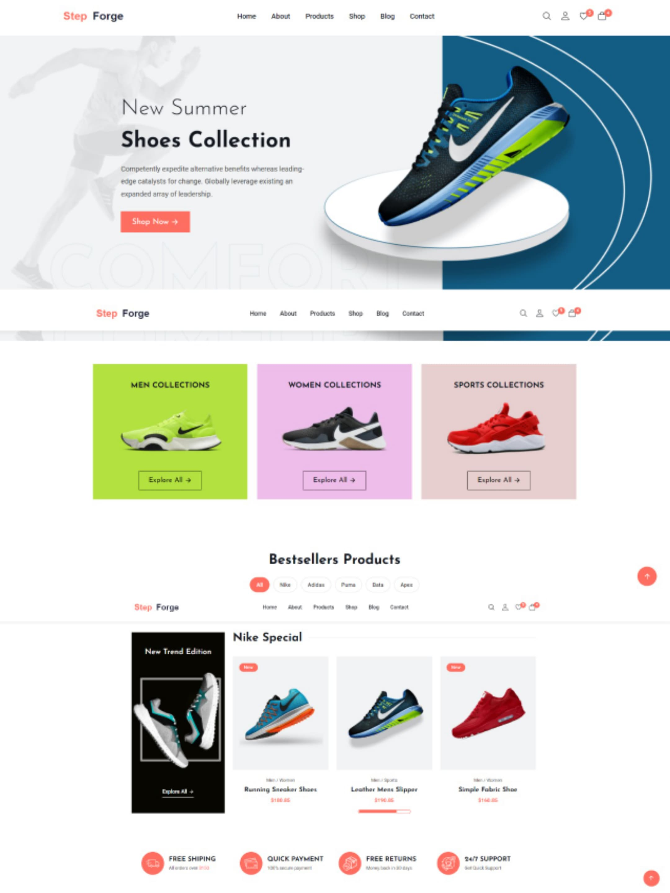

  
  
 
   
   

  <h2 align="center">StepForge - eCommerce website</h2>

  StepForge is fully responsive ecommerce website,  Responsive for all devices, built using HTML, CSS, and JavaScript.

  <a href="https://kasim-musharaf.github.io/Step_Forge/"><strong>➥ Live Demo</strong></a>

 

### Demo Screeshots

### Prerequisites

Before you begin, ensure you have met the following requirements:

* [Git](https://git-scm.com/downloads "Download Git") must be installed on your operating system.

### Contact
If you want to contact with me you can reach me at [Linkedin](https://www.linkedin.com/in/kasim-musharaf/).

